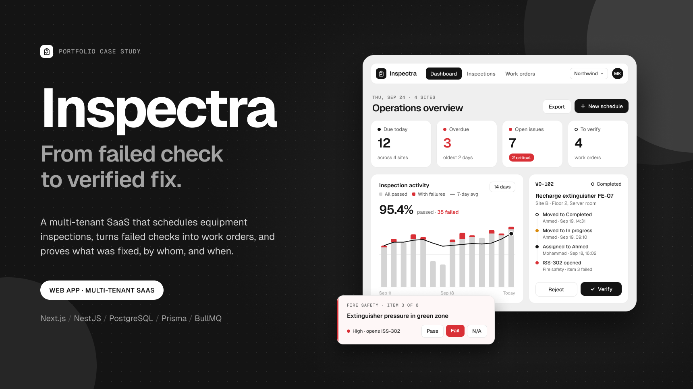
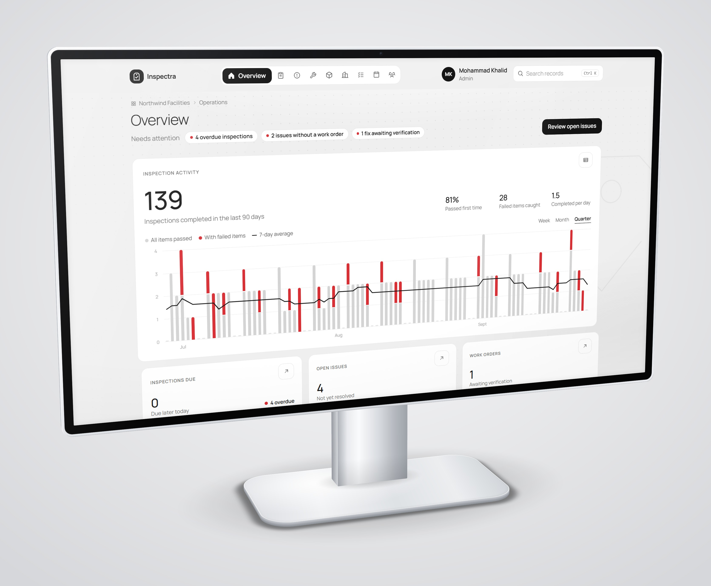
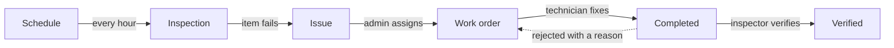

[Docs](./README.md) › **Case study**

# Case study

| Role | Focus | Stack | Year |
| --- | --- | --- | --- |
| Solo: design + full-stack development | Multi-tenant backend · UI system | Next.js · NestJS · PostgreSQL · Prisma · BullMQ | 2026 |

## The problem

Facilities teams inspect the same equipment again and again: fire extinguishers every month, forklifts before every shift, rooftop HVAC units every week. Most teams still run this on paper checklists, spreadsheets and group chats.

That causes real problems:

- **Checks get missed**, because nobody notices an inspection that was never done until something goes wrong.
- **Failures go nowhere.** An inspector ticks *Fail*, but the note never reaches the person who can fix it.
- **"Fixed" can't be proven.** When an auditor asks who repaired the extinguisher and who checked the repair, the answer is buried in someone's inbox.

## The goal

1. Make inspections happen on time, without anyone creating them by hand.
2. Turn every failed check into tracked work, automatically.
3. Close the loop: a fix only counts once someone else has verified it.
4. Keep a history nobody can quietly rewrite.
5. Keep every organization's data fully private, in a product many companies share.

## The solution

Inspectra is one overview plus eight focused pages: **Inspections, Issues, Work orders, Assets, Sites, Templates, Schedules** and **Members**. Admins set up the equipment and the checklists. Inspectors fill in checklists on the floor. Technicians fix what failed. Everyone sees the same live record.

The whole product is built around one loop:

Behind the screens is a real backend. The Next.js app talks to a NestJS REST API, the API stores everything in PostgreSQL, and a Redis-backed job queue creates inspections on time. See [System design](./04-system-design.md) for how they fit together.

## Key challenges

### 1. Creating inspections on time, in every timezone, never twice

**Challenge:** A daily forklift check at 07:00 means 07:00 in Manchester, not 07:00 on the server. And if the job runs twice, or on two servers at once, nobody should get the same checklist twice.

**Solution:** A BullMQ job runs every hour, and once when the API starts. For each active schedule it works out the current due time in the **site's own timezone** (daily → today, weekly → Monday, monthly → the 1st), then stores it in UTC. A unique database key on *(schedule, due time)* makes a second copy impossible, however often the job runs.

### 2. Keeping every organization private

**Challenge:** Many companies share one database. A single forgotten `where organizationId = …` would leak one company's data to another.

**Solution:** Services never add that filter themselves. A Prisma extension reads the organization from the current request and adds it to **every** query on every tenant table, and stamps it on every insert. If code ever touches tenant data without an organization, it throws instead of returning everything. Asking for another organization's record returns *404 Not found*, so you can't even tell it exists.

### 3. A fix isn't done until someone checks it

**Challenge:** "Completed" from the person who did the work isn't proof. Technicians, inspectors and admins each need different powers, and the API and the screen must agree on them.

**Solution:** The work order lifecycle is one table of allowed moves in a shared package: who can make each move, whether only the assignee can, and whether a reason is required. The API enforces it and the web app uses the same table to decide which buttons to show. Only an inspector or admin can verify a fix. Rejecting it needs a written reason and sends it back to the technician. Verifying it resolves the original issue in the same transaction.

### 4. A history nobody can rewrite

**Challenge:** If someone edits a checklist next month, last month's inspections must still show the questions that were actually asked. And the logbook must never miss a step.

**Solution:** Each inspection copies the checklist's questions when it's created, so editing a template only changes future inspections. Every change writes an audit event **inside the same transaction** as the change itself: either both are saved, or neither is. Human-friendly numbers like `INS-1048`, `ISS-302` and `WO-102` are handed out per organization with a row lock, so two people can never get the same one.

## Results

- **9 main screens** plus detail pages for inspections, work orders and assets, all backed by live data.
- **30 REST endpoints**, with Clerk sign-in and role-based permissions on every route.
- **13 PostgreSQL tables**, isolated per organization at the data layer.
- **Hands-free scheduling:** inspections appear on time in each site's local time, with no manual work.
- **170+ automated tests**, including concurrency and cross-tenant tests against a real database, run in CI on every push.
- **One command** to run the whole stack: `pnpm docker:up`.

## What I learned

- **Put safety in the database.** Unique keys, row locks and transactions protect against double clicks, retries and race conditions better than any `if` check in code.
- **Make the safe path the only path.** Tenant isolation that every developer must remember will be forgotten once. Tenant isolation built into the data layer can't be.
- **Share the rules, not just the types.** Defining the permissions and the work order lifecycle once kept the API and the UI from ever disagreeing.
- **Test what can go wrong, not just what should go right.** The most valuable tests submit the same inspection twice at once, or try to read another organization's data.
- **Document the trade-offs.** Knowing what I left out, and why, matters as much as what I built. See [Engineering decisions](./09-engineering-decisions.md).

---

[← Docs home](./README.md) · [Screenshots →](./02-screenshots.md)

