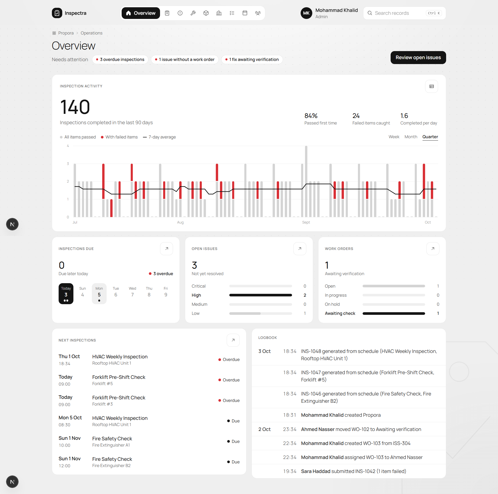
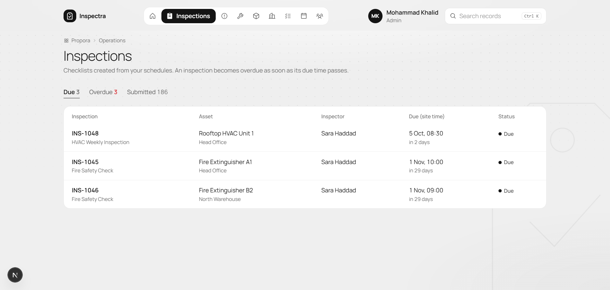
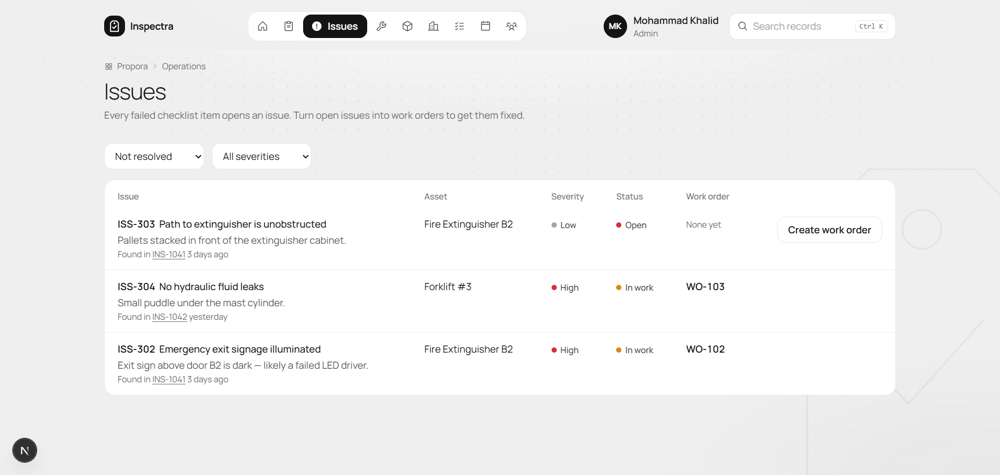
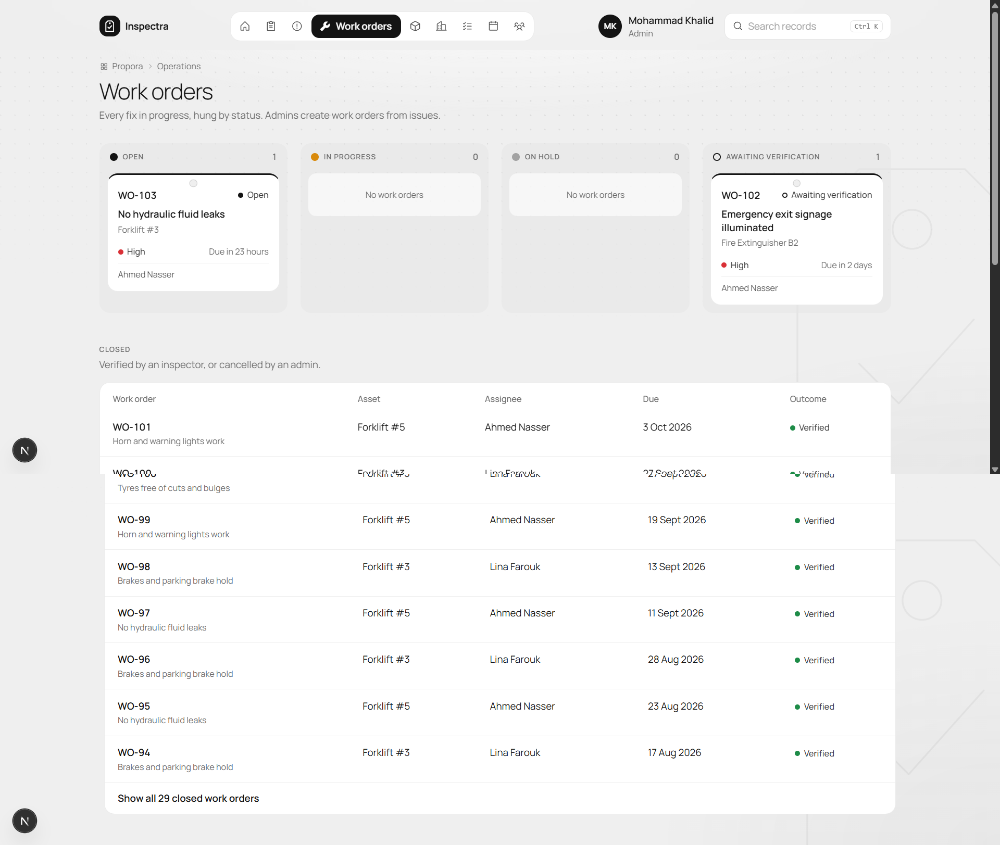
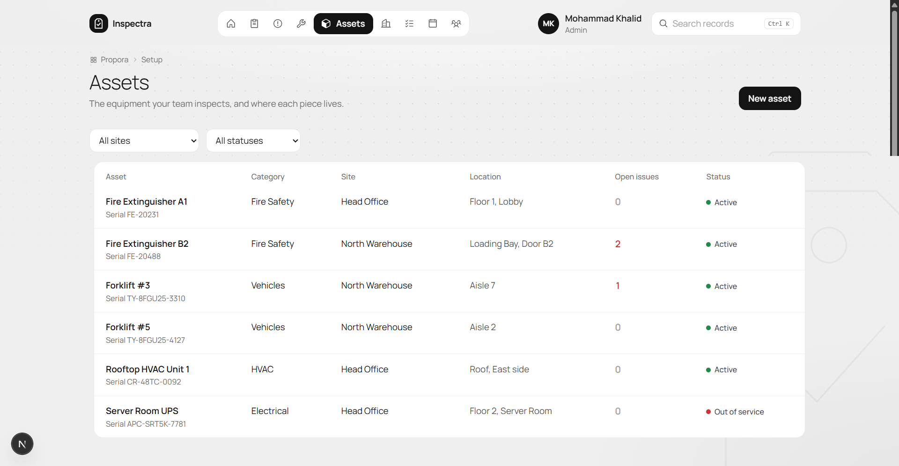
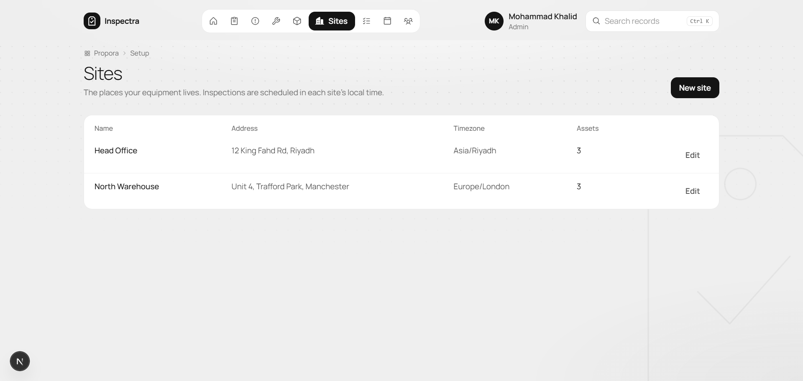
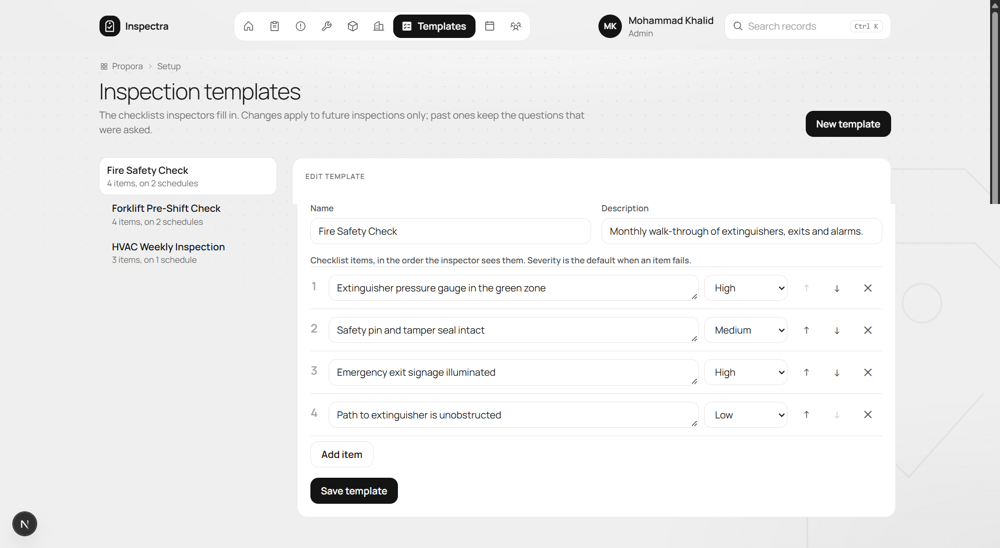
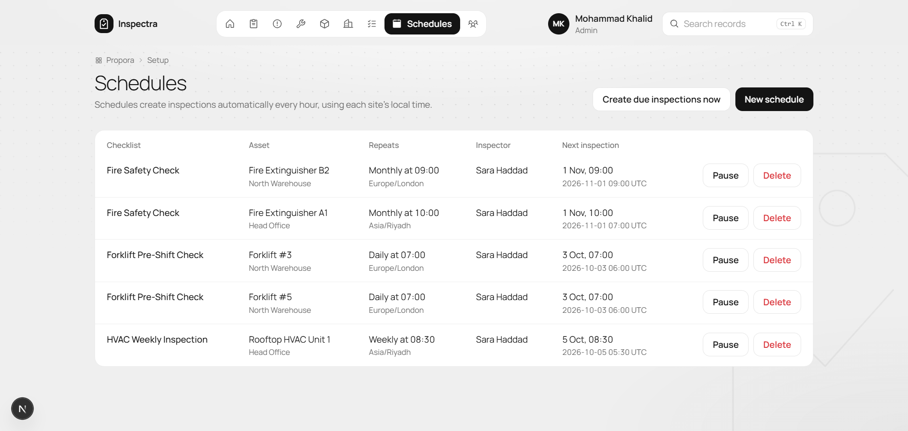
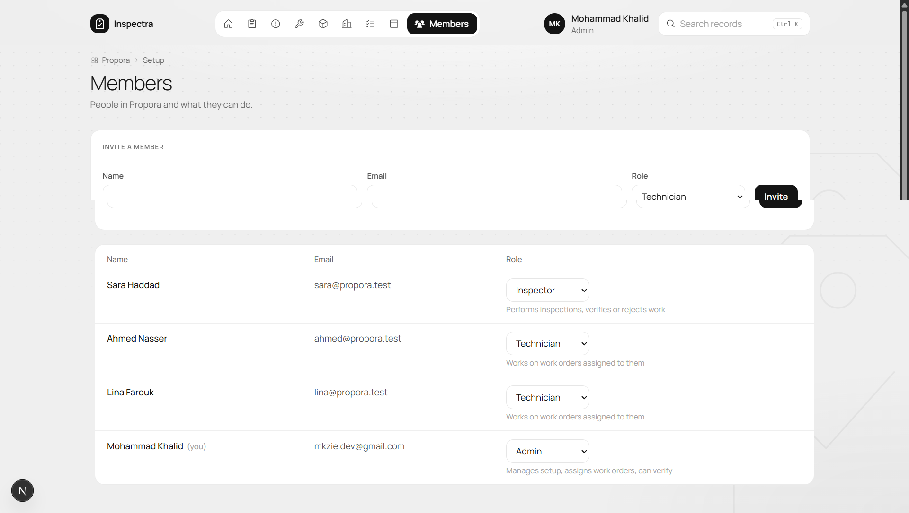

[Docs](./README.md) › **Screenshots**

# Screenshots

A quick tour of Inspectra, seen as an admin, with two sites, six assets and three months of inspection history.

[Overview](#overview) · [Inspections](#inspections) · [Issues](#issues) · [Work orders](#work-orders) · [Assets](#assets) · [Sites](#sites) · [Templates](#templates) · [Schedules](#schedules) · [Members](#members)

---

### Overview

The answer to *"What needs attention?"* Alerts for overdue inspections, unassigned issues and fixes awaiting verification, a 90-day inspection activity chart, the week ahead, and the logbook.

### Inspections

Checklists created from schedules, split into *Due*, *Overdue* and *Submitted*. Due times are shown in each site's local time.

### Issues

Every failed checklist item opens an issue. Admins turn open issues into work orders with one click.

### Work orders

Every fix in progress, as a board by status. Closed work orders, verified or cancelled, are listed below.

### Assets

The equipment your team inspects, where each piece lives, and how many open issues it has.

### Sites

The places your equipment lives. Each site has its own timezone, and inspections are scheduled in it.

### Templates

The checklists inspectors fill in. Each item has a default severity for when it fails. Edits only apply to future inspections.

### Schedules

Which checklist runs on which asset, how often, at what local time, and for which inspector. The next inspection is shown in local time and in UTC.

### Members

Invite people and set their role. Each role says what it can do.

---

[← Case study](./01-case-study.md) · [Docs home](./README.md) · [Features →](./03-features.md)

