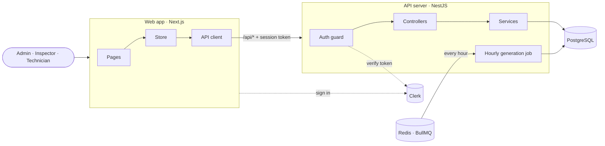
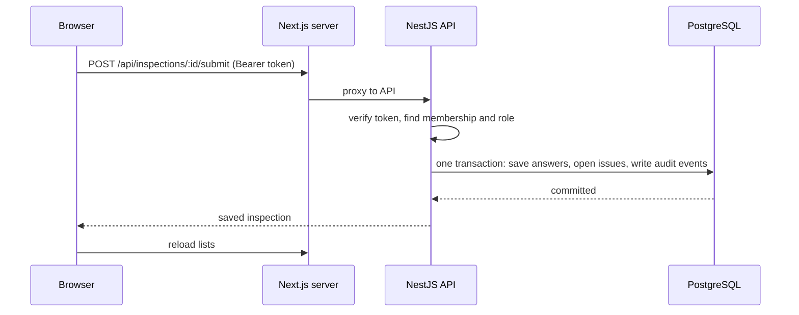

[Docs](./README.md) › **System design**

# System design

Inspectra has four parts: a **web app** that people use, an **API server** that holds the rules, a **PostgreSQL database** that stores the data, and a **Redis job queue** that creates inspections on time. Sign-in is handled by **Clerk**.


## The parts



| Part | Built with | Job |
| --- | --- | --- |
| **Web app** | Next.js 16, React 19, Tailwind CSS | Shows the screens, checks forms early, and keeps the loaded data in one store |
| **API server** | NestJS 12, Prisma, Zod | Checks who's calling, applies the permissions and business rules, saves data, writes the audit log |
| **Database** | PostgreSQL 18 | Stores every table, with each row tagged by its organization |
| **Job queue** | Redis 8, BullMQ | Runs inspection generation every hour, with retries |
| **Shared package** | TypeScript, Zod | Types, request schemas, permissions, the work order lifecycle and timezone maths, used by both apps |
| **Sign-in** | Clerk | Proves who the person is. Everything after that (organizations, roles) is Inspectra's own data. |

## How a request flows



1. **Sign in.** Clerk signs the person in and gives the browser a short-lived session token (about a minute, refreshed automatically).
2. **Load the organization.** The app asks `GET /api/me` who it is, then loads members, sites, assets, templates, schedules, inspections, issues, work orders and the audit log in parallel.
3. **Call the API.** The browser only ever calls `/api/*` on its own address. The Next.js server proxies it to the API, so there's no CORS in the browser and the API's address never ends up in client code.
4. **Check the caller.** Every request gets a request ID. The auth guard verifies the token, finds the person's membership, and sets their organization and role. Then it checks the route's required permission.
5. **Save.** The service runs the change in one transaction. The tenant-scoped database client adds the organization to every query, and an audit event is written alongside the change.
6. **Show the result.** After every write, the app reloads its data from the server, so every page shows exactly what's in the database. If something fails, the server's message is shown instead.

## Inside the web app

```
apps/web/
├── app/            one folder per route: dashboard, inspections/[id], issues,
│                   work-orders/[id], assets/[id], sites, templates, schedules,
│                   settings/members
├── components/     app shell, UI kit, status badges, charts, search,
│                   sign-in and onboarding screens
└── lib/            API client, Clerk bridge, the store, formatting helpers
```

- **One store for the organization.** After sign-in the store holds the organization's data, and every page reads from it.
- **The server owns the data.** The app never invents ids or saves locally. It sends a request, waits for the result, then reloads.
- **Screens follow the rules.** The navigation and the buttons on a work order come from the same shared permission map and transition table as the API.

## Inside the API

```
apps/api/
├── prisma/                schema and migrations
├── src/
│   ├── main.ts            start-up: global /api prefix, CORS, listen
│   ├── common/            auth guard and Clerk, request context, errors,
│   │                      Zod validation pipe, record numbering
│   ├── infrastructure/    tenant-scoped Prisma client, BullMQ queue
│   ├── <resource>/        one controller + service per resource:
│   │                      sites, assets, templates, schedules, inspections,
│   │                      issues, work-orders, members, organizations, audit
│   └── health/            the public health check
└── test/                  integration tests against a real database
```

- **Thin controllers, focused services.** Controllers declare the route, the input schema and the required permission. Services hold the business logic.
- **One guard for everyone.** Every route needs a signed-in member unless it's marked `@Public()` (the health check) or `@IdentityOnly()` (creating your first organization).
- **One error shape.** A single exception filter turns every failure into `{ error: { code, message, requestId } }`.

## Inside the shared package

```
packages/shared/src/
├── domain.ts        response shapes (Site, Asset, Inspection, WorkOrder…)
├── inputs.ts        Zod schemas for every request body
├── permissions.ts   the role → action map and can()
├── work-orders.ts   the work order lifecycle table
├── schedule.ts      due-time maths in each site's timezone
└── api-error.ts     error codes and the error body
```

A change here breaks the build on **both** sides instead of silently breaking production.

## Security basics

| Area | How it's handled |
| --- | --- |
| **Sign-in** | Clerk session tokens, verified on every request. Tokens made for any other website are rejected. |
| **Account linking** | Only a verified email can claim an invite, so nobody can sign up as someone else's invitee |
| **Permissions** | One role → action map, checked by the auth guard. No `if (role === 'ADMIN')` scattered through the code. |
| **Data access** | Every query is filtered by the caller's organization in the data layer. Without an organization it fails instead of returning everything. |
| **Validation** | Every body and query is checked with a Zod schema, and every id must be a valid UUID |
| **Errors** | One error shape, no stack traces, and a request ID to trace any failure in the logs |
| **Containers** | Both images run as the non-root `node` user. The API container has a health check, and the web app waits for it. |

---

<div align="center">

[← Features](./03-features.md) · [Docs home](./README.md) · [Database design →](./05-database-design.md)

</div>
