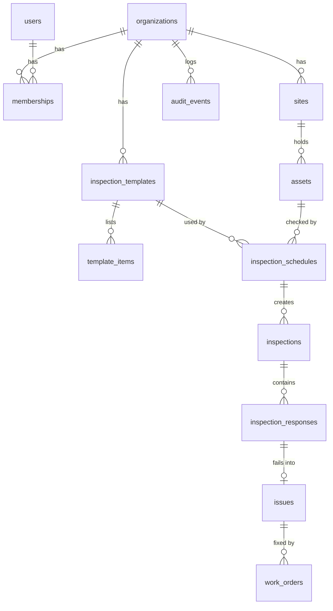

[Docs](./README.md) › **Database design**

# Database design

Inspectra uses **PostgreSQL** with **13 tables**, managed with Prisma. The diagram shows the key columns of each table and how they connect.


## The tables

| Table | Stores | Main links |
| --- | --- | --- |
| `organizations` | Each customer company, plus its `INS-`, `ISS-` and `WO-` number counters | Owns everything below |
| `users` | People: name, email, and their Clerk id once they've signed in | Shared across organizations |
| `memberships` | Who belongs to which organization, and their role | → `organizations`, `users` |
| `sites` | Places: name, address, IANA timezone | → `organizations` |
| `assets` | Equipment: name, category, serial, location, status | → `sites` |
| `inspection_templates` | Checklists: name, description | → `organizations` |
| `template_items` | Checklist items: position, prompt, default severity | → `inspection_templates` |
| `inspection_schedules` | What runs when: frequency, local time, inspector, active flag | → templates, assets, users |
| `inspections` | One checklist to fill in: number, due time, status, template name snapshot | → schedules, assets, users |
| `inspection_responses` | One answer per item: prompt snapshot, result, notes, severity | → `inspections` |
| `issues` | One per failed item: number, title, notes, severity, status | → inspections, responses, assets |
| `work_orders` | The fix: number, assignee, status, due date | → `issues`, users |
| `audit_events` | The logbook: actor, entity, action, message, before and after | → any entity |

## How it fits together



```
organizations
 ├──< memberships >── users
 ├──< sites ──< assets
 ├──< inspection_templates ──< template_items
 ├──< inspection_schedules            (template + asset + inspector)
 │     └──< inspections ──< inspection_responses
 │                               └──o issues ──< work_orders
 └──< audit_events
```

*Read `A ──< B` as "one A has many B", `A >── B` as "many A point to one B", and `A ──o B` as "one A has zero or one B".*

## Rules worth knowing

- **Every row has an organization.** Every table except `users` and `organizations` has an `organization_id`. The tenant-scoped Prisma client adds it to every query and every insert, so services never filter by hand.
- **People are global, roles are not.** A `users` row is one person across Inspectra. Their role lives on the `memberships` row, so the same person could be an admin in one organization and a technician in another.
- **Ids are UUIDs, numbers are for people.** Every row has a UUID. Inspections, issues and work orders also get a short number per organization (`INS-1001`, `ISS-301`, `WO-101` onwards), unique within that organization.
- **Duplicates are impossible, not just unlikely.**
  - `inspections (schedule_id, due_at)` is unique, so the hourly job can't create the same inspection twice.
  - `issues (inspection_response_id)` is unique, so a retried submit can't open a second issue for the same failed item.
- **History is a snapshot.** An inspection copies the template's name and each item's prompt when it's created. Editing a template later never changes what past inspections asked.
- **Times are stored in UTC.** A site stores its IANA timezone (like `Europe/London`) and a schedule stores its time as `HH:mm` in that timezone. Due times are worked out from those and saved in UTC.
- **Assignment is a field, not a status.** A work order's `assignee_id` says who; its `status` says where the work is: *Open → In progress → On hold → Completed → Verified*, or *Cancelled*.
- **The logbook stores before and after.** Each audit event keeps a JSON snapshot of the change. `actor_id` is empty for system actions, like the hourly job.
- **Some links are ids on purpose.** Inspections keep their `schedule_id` without a foreign key, so deleting a schedule never touches the inspections it already created.
- **Indexes match the screens.** For example `inspections (organization_id, status, due_at)` serves the *Due* and *Overdue* tabs, and `audit_events (organization_id, created_at)` serves the logbook.

## Migrations

The schema lives in [`apps/api/prisma/schema.prisma`](../apps/api/prisma/schema.prisma), with versioned migrations next to it. In Docker, the API container runs `prisma migrate deploy` before it starts, so the database is always up to date.

## Starting data

There's no seed script. A new organization starts empty. The usual setup order is **sites → assets → templates → members → schedules**. After that, inspections appear on their own.

---

<div align="center">

[← System design](./04-system-design.md) · [Docs home](./README.md) · [API reference →](./06-api-reference.md)

</div>
