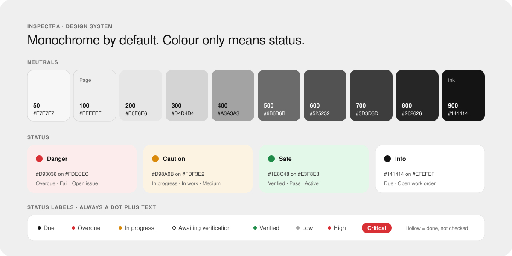

[Docs](./README.md) › **Design system**

# Design system

Inspectra's look follows one idea: **an inspection sheet, not a dashboard toy**. Black ink on light grey paper, one font, and colour kept for one job only: telling you the status of something.



## Principles

1. **Black means action.** Main buttons, the active navigation item and the focus ring are ink (`#141414`). Nothing else competes with them.
2. **Colour only means status.** Red, amber and green appear as small dots, short labels and chart marks, never as decoration.
3. **Colour is never alone.** A status is always a dot **plus** a text label, so it still reads for colour-blind users and in greyscale prints.
4. **Quiet surfaces.** White cards on a light grey page, hairline borders, and no card shadows. The data stands out, not the interface.

## Colours

The whole neutral scale is remapped over Tailwind's `slate`, so every grey utility in the app follows it.

| Role | Token | Hex | Used for |
| --- | --- | --- | --- |
| Ink | `slate-900` | `#141414` | Headings, body text, main buttons, active navigation, focus ring |
| Ink hover | `slate-700` | `#3D3D3D` | Main button on hover |
| Secondary text | `slate-600` | `#525252` | Form labels, supporting copy |
| Muted text | `slate-500` | `#6B6B6B` | Descriptions, panel labels, timestamps |
| Neutral mark | `slate-400` | `#A3A3A3` | *Low*, *On hold*, *Cancelled*, *Retired* dots |
| Border | `slate-200` | `#E6E6E6` | Cards, inputs and dividers |
| Page | `slate-100` | `#EFEFEF` | Page background |
| Surface | white | `#FFFFFF` | Cards, tables, dialogs, navigation bar |

## Status colours

Each status colour has a strong tone for dots and text, and a soft tone for backgrounds.

| Tone | Strong on soft | Used for |
| --- | --- | --- |
| Danger | `#D93036` on `#FDECEC` | Overdue, Fail, High severity, Open issue, Out of service |
| Caution | `#D98A0B` on `#FDF3E2` | In progress, In work, Medium severity |
| Safe | `#1E8C48` on `#E3F8E8` | Verified, Pass, Submitted, Active |
| Info | `#141414` on `#EFEFEF` | Due, Open work order |
| Neutral | `#A3A3A3` | Low severity, On hold, Cancelled, Retired |

Two special cases:

- **Critical** is the only filled label: a solid red pill with white text, because it must win every scan of the page.
- **Awaiting verification** is a **hollow** ink ring: the work is done, but not yet checked.

Every status maps to a tone in one place ([`components/badges.tsx`](../apps/web/components/badges.tsx)), so a page never picks a colour by itself.

## Typography

- **Font:** [Manrope](https://fonts.google.com/specimen/Manrope) everywhere, weights 300–700.
- **Headings:** light weight (300) with tight tracking. Page titles are 34px.
- **Panel labels:** 11px, semibold, uppercase, with wide letter spacing (*INSPECTION ACTIVITY*, *LOGBOOK*).
- **Numbers:** tabular figures for counts, times and record numbers, so columns line up.
- **Voice:** sentence case and plain verbs, like *"Create work order"*, *"Send back to technician"* and *"Answer every item on this checklist before submitting."*

## Shape and depth

| Token | Value | Used for |
| --- | --- | --- |
| Card radius | `16px` | Cards, tables, panels and dialogs |
| Control radius | `12px` | Buttons, inputs, selects and navigation items |
| Pill radius | `999px` | Avatars and the *Critical* label |
| Touch target | `40px` minimum | Every button and input |
| Card border | `1px` `#E6E6E6` at 80% | Every card, no shadow |
| Overlay shadow | soft ink at 10% | Menus and dialogs only |

## Backdrop

The page background is the one decorative touch, and it follows the brand:

- A **dot grid**, like a sheet of inspection paper, that fades out down the page.
- A **soft light** from the top of the screen.
- A large, very faint **hang tag with a tick** in the corner: the same shape as the logo.

All three sit in fixed layers behind the content, so scrolling and reading are unaffected.

## Components

| Component | What it looks like |
| --- | --- |
| **Buttons** | Primary: solid ink. Secondary: white with a grey border. Danger: white with red text. Ghost: text only. |
| **Navigation** | A white pill bar. The active page is an ink pill with its icon and name; the others are icons with a tooltip. |
| **Card** | White, 16px radius, hairline border, with a small uppercase label as its header |
| **Status label** | A small dot plus a short label (see status colours above) |
| **Record number** | `INS-1048`, `ISS-302`, `WO-102` in semibold tabular figures |
| **Checklist item** | A three-way *Pass / Fail / N/A* switch. A failed item gets a red bar on its left edge and a soft red background. |
| **Dialog** | A native `<dialog>` with a white card over a dimmed backdrop. Closes with Escape. |
| **Charts** | Hand-drawn SVG: grey bars for clean days, red for days with failures, and an ink line for the 7-day average. Each chart can flip into a table. No chart library. |
| **Icons** | [Phosphor](https://phosphoricons.com/), regular weight, filled when active |

## Motion

- **Minimal on purpose.** Only colours and opacity change, on hover and focus, so nothing moves while someone is filling in a checklist.

## In code

The tokens live in one `@theme` block in [`apps/web/app/globals.css`](../apps/web/app/globals.css) (Tailwind CSS v4), so they work as normal utility classes:

```css
@theme {
  --color-slate-100: #efefef;   /* page */
  --color-slate-200: #e6e6e6;   /* border */
  --color-slate-500: #6b6b6b;   /* muted text */
  --color-slate-900: #141414;   /* ink */

  --color-danger: #d93036;
  --color-danger-soft: #fdecec;
  --color-caution: #d98a0b;
  --color-safe: #1e8c48;
}
```

```html
<button class="rounded-xl bg-slate-900 px-4 text-sm font-semibold text-white hover:bg-slate-700">New schedule</button>
```

Clerk's sign-in screens use the same palette, set in [`apps/web/lib/auth-config.ts`](../apps/web/lib/auth-config.ts).

---

<div align="center">

[← API reference](./06-api-reference.md) · [Docs home](./README.md) · [Getting started →](./08-getting-started.md)

</div>
